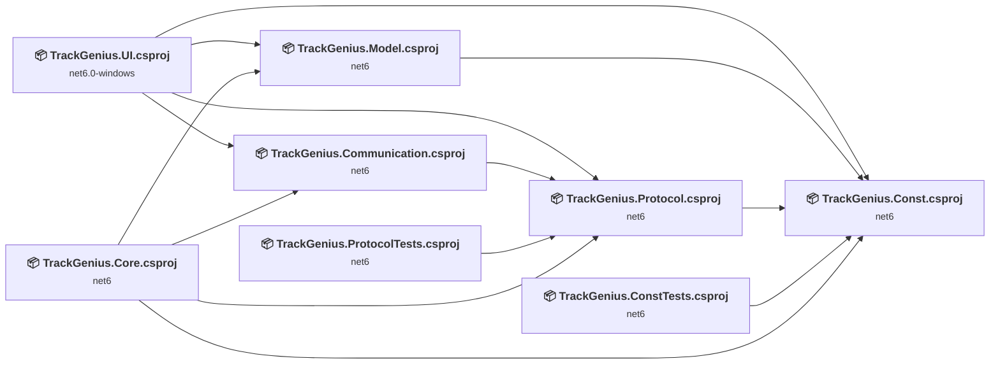
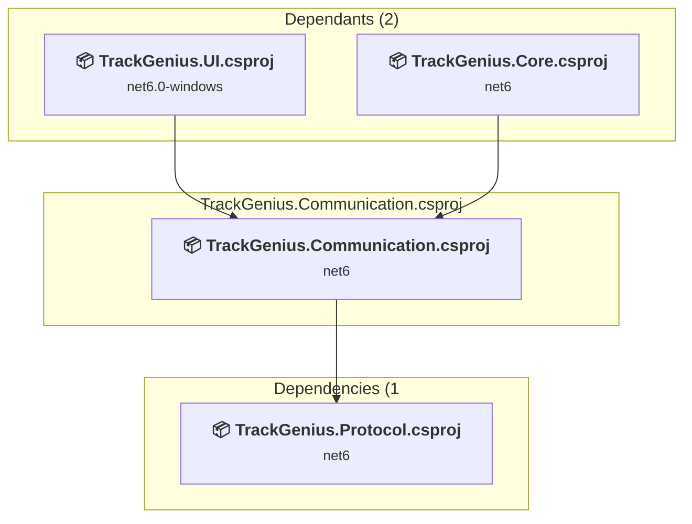
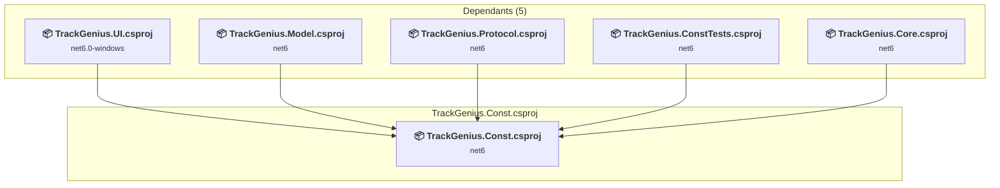
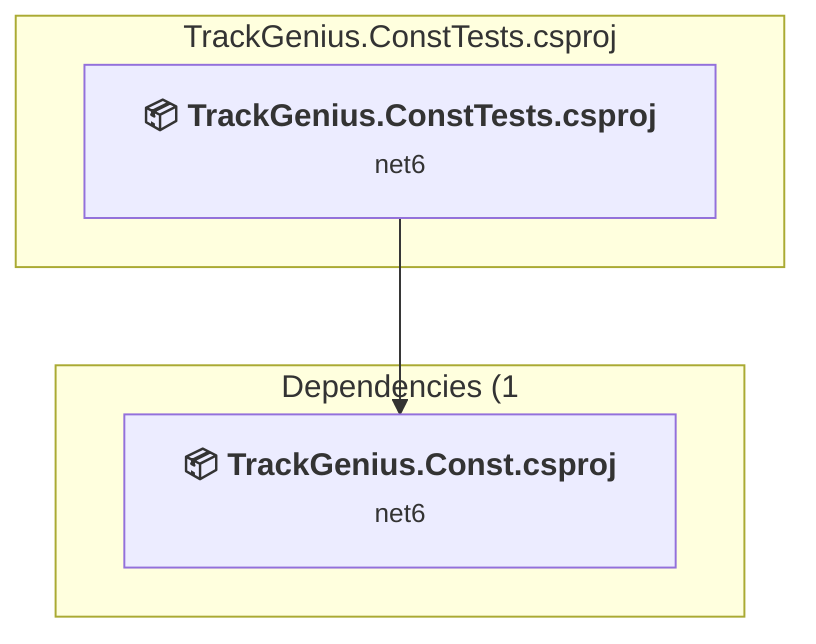
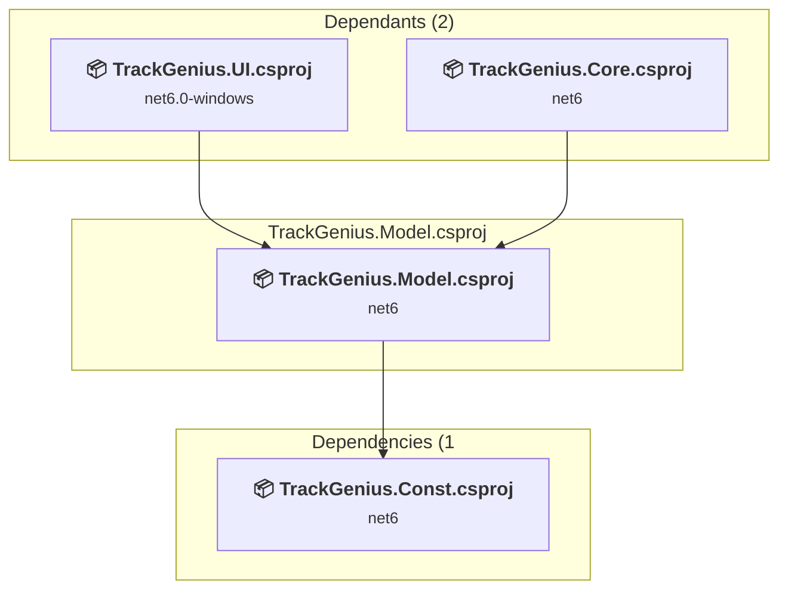
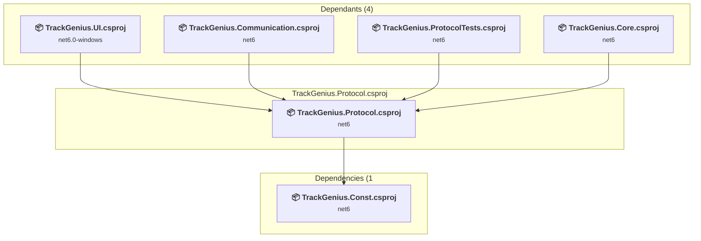
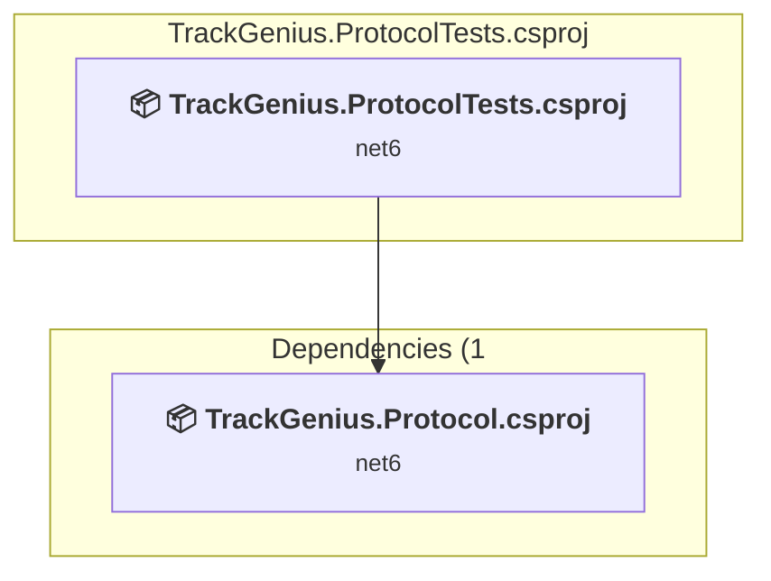
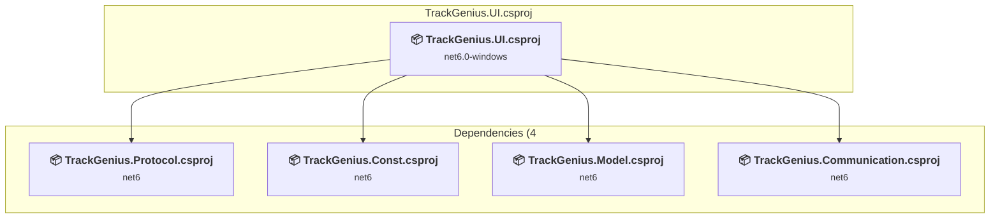

# Projects and dependencies analysis

This document provides a comprehensive overview of the projects and their dependencies in the context of upgrading to .NETCoreApp,Version=v8.0.

## Table of Contents

- [Executive Summary](#executive-Summary)
  - [Highlevel Metrics](#highlevel-metrics)
  - [Projects Compatibility](#projects-compatibility)
  - [Package Compatibility](#package-compatibility)
  - [API Compatibility](#api-compatibility)
- [Aggregate NuGet packages details](#aggregate-nuget-packages-details)
- [Top API Migration Challenges](#top-api-migration-challenges)
  - [Technologies and Features](#technologies-and-features)
  - [Most Frequent API Issues](#most-frequent-api-issues)
- [Projects Relationship Graph](#projects-relationship-graph)
- [Project Details](#project-details)

  - [TrackGenius.Communication\TrackGenius.Communication.csproj](#trackgeniuscommunicationtrackgeniuscommunicationcsproj)
  - [TrackGenius.Const\TrackGenius.Const.csproj](#trackgeniusconsttrackgeniusconstcsproj)
  - [TrackGenius.ConstTests\TrackGenius.ConstTests.csproj](#trackgeniusconstteststrackgeniusconsttestscsproj)
  - [TrackGenius.Core\TrackGenius.Core.csproj](#trackgeniuscoretrackgeniuscorecsproj)
  - [TrackGenius.Model\TrackGenius.Model.csproj](#trackgeniusmodeltrackgeniusmodelcsproj)
  - [TrackGenius.Protocol\TrackGenius.Protocol.csproj](#trackgeniusprotocoltrackgeniusprotocolcsproj)
  - [TrackGenius.ProtocolTests\TrackGenius.ProtocolTests.csproj](#trackgeniusprotocolteststrackgeniusprotocoltestscsproj)
  - [TrackGenius\TrackGenius.UI.csproj](#trackgeniustrackgeniusuicsproj)

## Executive Summary

### Highlevel Metrics

| Metric | Count | Status |
| :--- | :---: | :--- |
| Total Projects | 8 | All require upgrade |
| Total NuGet Packages | 40 | 3 need upgrade |
| Total Code Files | 76 |  |
| Total Code Files with Incidents | 20 |  |
| Total Lines of Code | 1856 |  |
| Total Number of Issues | 227 |  |
| Estimated LOC to modify | 183+ | at least 9.9% of codebase |

### Projects Compatibility

| Project | Target Framework | Difficulty | Package Issues | API Issues | Est. LOC Impact | Description |
| :--- | :---: | :---: | :---: | :---: | :---: | :--- |
| [TrackGenius.Communication\TrackGenius.Communication.csproj](#trackgeniuscommunicationtrackgeniuscommunicationcsproj) | net6 | 🟢 Low | 20 | 0 |  | ClassLibrary, Sdk Style = True |
| [TrackGenius.Const\TrackGenius.Const.csproj](#trackgeniusconsttrackgeniusconstcsproj) | net6 | 🟢 Low | 3 | 0 |  | ClassLibrary, Sdk Style = True |
| [TrackGenius.ConstTests\TrackGenius.ConstTests.csproj](#trackgeniusconstteststrackgeniusconsttestscsproj) | net6 | 🟢 Low | 1 | 0 |  | ClassLibrary, Sdk Style = True |
| [TrackGenius.Core\TrackGenius.Core.csproj](#trackgeniuscoretrackgeniuscorecsproj) | net6 | 🟢 Low | 2 | 0 |  | ClassLibrary, Sdk Style = True |
| [TrackGenius.Model\TrackGenius.Model.csproj](#trackgeniusmodeltrackgeniusmodelcsproj) | net6 | 🟢 Low | 3 | 0 |  | ClassLibrary, Sdk Style = True |
| [TrackGenius.Protocol\TrackGenius.Protocol.csproj](#trackgeniusprotocoltrackgeniusprotocolcsproj) | net6 | 🟢 Low | 2 | 0 |  | ClassLibrary, Sdk Style = True |
| [TrackGenius.ProtocolTests\TrackGenius.ProtocolTests.csproj](#trackgeniusprotocolteststrackgeniusprotocoltestscsproj) | net6 | 🟢 Low | 1 | 0 |  | ClassLibrary, Sdk Style = True |
| [TrackGenius\TrackGenius.UI.csproj](#trackgeniustrackgeniusuicsproj) | net6.0-windows | 🟡 Medium | 4 | 183 | 183+ | Wpf, Sdk Style = True |

### Package Compatibility

| Status | Count | Percentage |
| :--- | :---: | :---: |
| ✅ Compatible | 37 | 92.5% |
| ⚠️ Incompatible | 2 | 5.0% |
| 🔄 Upgrade Recommended | 1 | 2.5% |
| ***Total NuGet Packages*** | ***40*** | ***100%*** |

### API Compatibility

| Category | Count | Impact |
| :--- | :---: | :--- |
| 🔴 Binary Incompatible | 181 | High - Require code changes |
| 🟡 Source Incompatible | 2 | Medium - Needs re-compilation and potential conflicting API error fixing |
| 🔵 Behavioral change | 0 | Low - Behavioral changes that may require testing at runtime |
| ✅ Compatible | 1043 |  |
| ***Total APIs Analyzed*** | ***1226*** |  |

## Aggregate NuGet packages details

| Package | Current Version | Suggested Version | Projects | Description |
| :--- | :---: | :---: | :--- | :--- |
| Castle.Core | 4.4.0 |  | [TrackGenius.ConstTests.csproj](#trackgeniusconstteststrackgeniusconsttestscsproj) [TrackGenius.ProtocolTests.csproj](#trackgeniusprotocolteststrackgeniusprotocoltestscsproj) | ✅Compatible |
| ControlzEx | 7.0.0-rc0118 | 6.0.0 | [TrackGenius.UI.csproj](#trackgeniustrackgeniusuicsproj) | ⚠️NuGet package is incompatible |
| JetBrains.Annotations | 2019.1.3 |  | [TrackGenius.Communication.csproj](#trackgeniuscommunicationtrackgeniuscommunicationcsproj) [TrackGenius.Protocol.csproj](#trackgeniusprotocoltrackgeniusprotocolcsproj) | ✅Compatible |
| MahApps.Metro | 3.0.0-alpha0513 | 2.4.11 | [TrackGenius.UI.csproj](#trackgeniustrackgeniusuicsproj) | ⚠️NuGet package is incompatible |
| Microsoft.CSharp | 4.7.0 |  | [TrackGenius.Communication.csproj](#trackgeniuscommunicationtrackgeniuscommunicationcsproj) [TrackGenius.Const.csproj](#trackgeniusconsttrackgeniusconstcsproj) [TrackGenius.ConstTests.csproj](#trackgeniusconstteststrackgeniusconsttestscsproj) [TrackGenius.Core.csproj](#trackgeniuscoretrackgeniuscorecsproj) [TrackGenius.Model.csproj](#trackgeniusmodeltrackgeniusmodelcsproj) [TrackGenius.Protocol.csproj](#trackgeniusprotocoltrackgeniusprotocolcsproj) [TrackGenius.ProtocolTests.csproj](#trackgeniusprotocolteststrackgeniusprotocoltestscsproj) [TrackGenius.UI.csproj](#trackgeniustrackgeniusuicsproj) | ✅Compatible |
| Microsoft.NET.Test.Sdk | 16.0.1 |  | [TrackGenius.ConstTests.csproj](#trackgeniusconstteststrackgeniusconsttestscsproj) [TrackGenius.ProtocolTests.csproj](#trackgeniusprotocolteststrackgeniusprotocoltestscsproj) | ✅Compatible |
| Microsoft.Win32.Registry | 4.3.0 |  | [TrackGenius.Communication.csproj](#trackgeniuscommunicationtrackgeniuscommunicationcsproj) | NuGet package functionality is included with framework reference |
| morelinq | 3.3.2 |  | [TrackGenius.Const.csproj](#trackgeniusconsttrackgeniusconstcsproj) | ✅Compatible |
| MSTest.TestAdapter | 1.3.2 |  | [TrackGenius.ConstTests.csproj](#trackgeniusconstteststrackgeniusconsttestscsproj) [TrackGenius.ProtocolTests.csproj](#trackgeniusprotocolteststrackgeniusprotocoltestscsproj) | ✅Compatible |
| MSTest.TestAdapter | 1.4.0 |  | [TrackGenius.ConstTests.csproj](#trackgeniusconstteststrackgeniusconsttestscsproj) [TrackGenius.ProtocolTests.csproj](#trackgeniusprotocolteststrackgeniusprotocoltestscsproj) | ✅Compatible |
| MSTest.TestFramework | 1.3.2 |  | [TrackGenius.ConstTests.csproj](#trackgeniusconstteststrackgeniusconsttestscsproj) [TrackGenius.ProtocolTests.csproj](#trackgeniusprotocolteststrackgeniusprotocoltestscsproj) | ✅Compatible |
| MSTest.TestFramework | 1.4.0 |  | [TrackGenius.ConstTests.csproj](#trackgeniusconstteststrackgeniusconsttestscsproj) [TrackGenius.ProtocolTests.csproj](#trackgeniusprotocolteststrackgeniusprotocoltestscsproj) | ✅Compatible |
| NSubstitute | 4.2.1 |  | [TrackGenius.ConstTests.csproj](#trackgeniusconstteststrackgeniusconsttestscsproj) [TrackGenius.ProtocolTests.csproj](#trackgeniusprotocolteststrackgeniusprotocoltestscsproj) | ✅Compatible |
| NUnit | 3.12.0 |  | [TrackGenius.ConstTests.csproj](#trackgeniusconstteststrackgeniusconsttestscsproj) [TrackGenius.ProtocolTests.csproj](#trackgeniusprotocolteststrackgeniusprotocoltestscsproj) | ✅Compatible |
| RJCP.SerialPortStream | 3.0.1 |  | [TrackGenius.Communication.csproj](#trackgeniuscommunicationtrackgeniuscommunicationcsproj) | ✅Compatible |
| System.Collections | 4.3.0 |  | [TrackGenius.Communication.csproj](#trackgeniuscommunicationtrackgeniuscommunicationcsproj) | NuGet package functionality is included with framework reference |
| System.Collections.Specialized | 4.3.0 |  | [TrackGenius.Communication.csproj](#trackgeniuscommunicationtrackgeniuscommunicationcsproj) | NuGet package functionality is included with framework reference |
| System.ComponentModel.Composition | 8.0.0 |  | [TrackGenius.Communication.csproj](#trackgeniuscommunicationtrackgeniuscommunicationcsproj) | ✅Compatible |
| System.Data.DataSetExtensions | 4.5.0 |  | [TrackGenius.Communication.csproj](#trackgeniuscommunicationtrackgeniuscommunicationcsproj) [TrackGenius.Const.csproj](#trackgeniusconsttrackgeniusconstcsproj) [TrackGenius.Core.csproj](#trackgeniuscoretrackgeniuscorecsproj) [TrackGenius.Model.csproj](#trackgeniusmodeltrackgeniusmodelcsproj) [TrackGenius.Protocol.csproj](#trackgeniusprotocoltrackgeniusprotocolcsproj) [TrackGenius.UI.csproj](#trackgeniustrackgeniusuicsproj) | NuGet package functionality is included with framework reference |
| System.Diagnostics.Debug | 4.3.0 |  | [TrackGenius.Communication.csproj](#trackgeniuscommunicationtrackgeniuscommunicationcsproj) | NuGet package functionality is included with framework reference |
| System.Diagnostics.FileVersionInfo | 4.3.0 |  | [TrackGenius.Communication.csproj](#trackgeniuscommunicationtrackgeniuscommunicationcsproj) | NuGet package functionality is included with framework reference |
| System.Diagnostics.Tools | 4.3.0 |  | [TrackGenius.Communication.csproj](#trackgeniuscommunicationtrackgeniuscommunicationcsproj) | NuGet package functionality is included with framework reference |
| System.Diagnostics.TraceSource | 4.3.0 |  | [TrackGenius.Communication.csproj](#trackgeniuscommunicationtrackgeniuscommunicationcsproj) | NuGet package functionality is included with framework reference |
| System.Drawing.Common | 8.0.6 | 8.0.27 | [TrackGenius.Model.csproj](#trackgeniusmodeltrackgeniusmodelcsproj) | NuGet package upgrade is recommended |
| System.IO | 4.3.0 |  | [TrackGenius.Communication.csproj](#trackgeniuscommunicationtrackgeniuscommunicationcsproj) | NuGet package functionality is included with framework reference |
| System.IO.FileSystem | 4.3.0 |  | [TrackGenius.Communication.csproj](#trackgeniuscommunicationtrackgeniuscommunicationcsproj) | NuGet package functionality is included with framework reference |
| System.IO.FileSystem.Primitives | 4.3.0 |  | [TrackGenius.Communication.csproj](#trackgeniuscommunicationtrackgeniuscommunicationcsproj) | NuGet package functionality is included with framework reference |
| System.Net.Http | 4.3.4 |  | [TrackGenius.Communication.csproj](#trackgeniuscommunicationtrackgeniuscommunicationcsproj) [TrackGenius.Const.csproj](#trackgeniusconsttrackgeniusconstcsproj) [TrackGenius.Core.csproj](#trackgeniuscoretrackgeniuscorecsproj) [TrackGenius.Model.csproj](#trackgeniusmodeltrackgeniusmodelcsproj) [TrackGenius.Protocol.csproj](#trackgeniusprotocoltrackgeniusprotocolcsproj) [TrackGenius.UI.csproj](#trackgeniustrackgeniusuicsproj) | NuGet package functionality is included with framework reference |
| System.Runtime | 4.3.0 |  | [TrackGenius.Communication.csproj](#trackgeniuscommunicationtrackgeniuscommunicationcsproj) | NuGet package functionality is included with framework reference |
| System.Runtime.Extensions | 4.3.0 |  | [TrackGenius.Communication.csproj](#trackgeniuscommunicationtrackgeniuscommunicationcsproj) | NuGet package functionality is included with framework reference |
| System.Runtime.Handles | 4.3.0 |  | [TrackGenius.Communication.csproj](#trackgeniuscommunicationtrackgeniuscommunicationcsproj) | ✅Compatible |
| System.Runtime.InteropServices | 4.3.0 |  | [TrackGenius.Communication.csproj](#trackgeniuscommunicationtrackgeniuscommunicationcsproj) | NuGet package functionality is included with framework reference |
| System.Runtime.InteropServices.RuntimeInformation | 4.3.0 |  | [TrackGenius.Communication.csproj](#trackgeniuscommunicationtrackgeniuscommunicationcsproj) | NuGet package functionality is included with framework reference |
| System.Text.Encoding | 4.3.0 |  | [TrackGenius.Communication.csproj](#trackgeniuscommunicationtrackgeniuscommunicationcsproj) | NuGet package functionality is included with framework reference |
| System.Threading | 4.3.0 |  | [TrackGenius.Communication.csproj](#trackgeniuscommunicationtrackgeniuscommunicationcsproj) | NuGet package functionality is included with framework reference |
| System.Threading.Overlapped | 4.3.0 |  | [TrackGenius.Communication.csproj](#trackgeniuscommunicationtrackgeniuscommunicationcsproj) | ✅Compatible |
| System.Threading.Tasks.Extensions | 4.3.0 |  | [TrackGenius.ConstTests.csproj](#trackgeniusconstteststrackgeniusconsttestscsproj) [TrackGenius.ProtocolTests.csproj](#trackgeniusprotocolteststrackgeniusprotocoltestscsproj) | NuGet package functionality is included with framework reference |
| System.Threading.Thread | 4.3.0 |  | [TrackGenius.Communication.csproj](#trackgeniuscommunicationtrackgeniuscommunicationcsproj) | NuGet package functionality is included with framework reference |
| System.Threading.ThreadPool | 4.3.0 |  | [TrackGenius.Communication.csproj](#trackgeniuscommunicationtrackgeniuscommunicationcsproj) | NuGet package functionality is included with framework reference |
| System.ValueTuple | 4.5.0 |  | [TrackGenius.Const.csproj](#trackgeniusconsttrackgeniusconstcsproj) | NuGet package functionality is included with framework reference |

## Top API Migration Challenges

### Technologies and Features

| Technology | Issues | Percentage | Migration Path |
| :--- | :---: | :---: | :--- |
| WPF (Windows Presentation Foundation) | 78 | 42.6% | WPF APIs for building Windows desktop applications with XAML-based UI that are available in .NET on Windows. WPF provides rich desktop UI capabilities with data binding and styling. Enable Windows Desktop support: Option 1 (Recommended): Target net9.0-windows; Option 2: Add <UseWindowsDesktop>true</UseWindowsDesktop>. |
| Legacy Configuration System | 2 | 1.1% | Legacy XML-based configuration system (app.config/web.config) that has been replaced by a more flexible configuration model in .NET Core. The old system was rigid and XML-based. Migrate to Microsoft.Extensions.Configuration with JSON/environment variables; use System.Configuration.ConfigurationManager NuGet package as interim bridge if needed. |

### Most Frequent API Issues

| API | Count | Percentage | Category |
| :--- | :---: | :---: | :--- |
| T:System.Windows.Controls.DockPanel | 12 | 6.6% | Binary Incompatible |
| T:System.Windows.Window | 11 | 6.0% | Binary Incompatible |
| T:System.Windows.Size | 10 | 5.5% | Binary Incompatible |
| T:System.Windows.Visibility | 10 | 5.5% | Binary Incompatible |
| T:System.Windows.RoutedEventHandler | 6 | 3.3% | Binary Incompatible |
| T:System.Windows.Application | 4 | 2.2% | Binary Incompatible |
| T:System.Windows.SystemCommands | 4 | 2.2% | Binary Incompatible |
| T:System.Windows.RoutedEventArgs | 4 | 2.2% | Binary Incompatible |
| M:System.Windows.Window.GetWindow(System.Windows.DependencyObject) | 4 | 2.2% | Binary Incompatible |
| M:System.Windows.Controls.UserControl.#ctor | 4 | 2.2% | Binary Incompatible |
| M:System.Windows.Window.#ctor | 4 | 2.2% | Binary Incompatible |
| T:System.Windows.Input.ExecutedRoutedEventHandler | 4 | 2.2% | Binary Incompatible |
| T:System.Windows.Input.CanExecuteRoutedEventHandler | 4 | 2.2% | Binary Incompatible |
| T:System.Windows.Thickness | 4 | 2.2% | Binary Incompatible |
| T:System.Windows.Shell.WindowChrome | 4 | 2.2% | Binary Incompatible |
| E:System.Windows.Controls.Primitives.ButtonBase.Click | 3 | 1.6% | Binary Incompatible |
| M:System.Windows.Application.LoadComponent(System.Object,System.Uri) | 3 | 1.6% | Binary Incompatible |
| T:System.Windows.WindowState | 3 | 1.6% | Binary Incompatible |
| T:System.Windows.Input.RoutedCommand | 2 | 1.1% | Binary Incompatible |
| T:System.Windows.Input.MouseButtonEventHandler | 2 | 1.1% | Binary Incompatible |
| T:System.Windows.Markup.IComponentConnector | 2 | 1.1% | Binary Incompatible |
| T:System.Windows.Controls.UserControl | 2 | 1.1% | Binary Incompatible |
| E:System.Windows.Input.CommandBinding.Executed | 2 | 1.1% | Binary Incompatible |
| E:System.Windows.Input.CommandBinding.CanExecute | 2 | 1.1% | Binary Incompatible |
| T:System.Windows.Input.ExecutedRoutedEventArgs | 2 | 1.1% | Binary Incompatible |
| T:System.Windows.Input.CanExecuteRoutedEventArgs | 2 | 1.1% | Binary Incompatible |
| F:System.Windows.Visibility.Hidden | 2 | 1.1% | Binary Incompatible |
| F:System.Windows.Visibility.Visible | 2 | 1.1% | Binary Incompatible |
| P:System.Windows.UIElement.Visibility | 2 | 1.1% | Binary Incompatible |
| M:System.Windows.Size.#ctor(System.Double,System.Double) | 2 | 1.1% | Binary Incompatible |
| T:System.Windows.Input.ApplicationCommands | 2 | 1.1% | Binary Incompatible |
| T:System.Windows.Input.RoutedUICommand | 2 | 1.1% | Binary Incompatible |
| P:System.Windows.Input.ApplicationCommands.New | 2 | 1.1% | Binary Incompatible |
| T:System.Windows.Input.CommandBinding | 2 | 1.1% | Binary Incompatible |
| M:System.Windows.Input.CommandBinding.#ctor(System.Windows.Input.ICommand) | 2 | 1.1% | Binary Incompatible |
| T:System.Windows.Input.CommandBindingCollection | 2 | 1.1% | Binary Incompatible |
| P:System.Windows.UIElement.CommandBindings | 2 | 1.1% | Binary Incompatible |
| M:System.Windows.Input.CommandBindingCollection.Add(System.Windows.Input.CommandBinding) | 2 | 1.1% | Binary Incompatible |
| P:System.Windows.FrameworkElement.DataContext | 2 | 1.1% | Binary Incompatible |
| P:System.Windows.Shell.WindowChrome.CaptionHeight | 2 | 1.1% | Binary Incompatible |
| M:System.Windows.Thickness.#ctor(System.Double,System.Double,System.Double,System.Double) | 2 | 1.1% | Binary Incompatible |
| P:System.Windows.Shell.WindowChrome.ResizeBorderThickness | 2 | 1.1% | Binary Incompatible |
| M:System.Windows.Shell.WindowChrome.#ctor | 2 | 1.1% | Binary Incompatible |
| M:System.Windows.Shell.WindowChrome.SetWindowChrome(System.Windows.Window,System.Windows.Shell.WindowChrome) | 2 | 1.1% | Binary Incompatible |
| T:System.Windows.Threading.DispatcherUnhandledExceptionEventHandler | 2 | 1.1% | Binary Incompatible |
| M:System.Windows.Markup.InternalTypeHelper.#ctor | 1 | 0.5% | Binary Incompatible |
| T:System.Windows.Markup.InternalTypeHelper | 1 | 0.5% | Binary Incompatible |
| E:System.Windows.UIElement.MouseLeftButtonDown | 1 | 0.5% | Binary Incompatible |
| M:System.Windows.SystemCommands.MaximizeWindow(System.Windows.Window) | 1 | 0.5% | Binary Incompatible |
| M:System.Windows.SystemCommands.RestoreWindow(System.Windows.Window) | 1 | 0.5% | Binary Incompatible |

## Projects Relationship Graph

Legend:
📦 SDK-style project
⚙️ Classic project

## Project Details

### TrackGenius.Communication\TrackGenius.Communication.csproj

#### Project Info

- **Current Target Framework:** net6
- **Proposed Target Framework:** net8.0
- **SDK-style**: True
- **Project Kind:** ClassLibrary
- **Dependencies**: 1
- **Dependants**: 2
- **Number of Files**: 10
- **Number of Files with Incidents**: 1
- **Lines of Code**: 214
- **Estimated LOC to modify**: 0+ (at least 0.0% of the project)

#### Dependency Graph

Legend:
📦 SDK-style project
⚙️ Classic project

### API Compatibility

| Category | Count | Impact |
| :--- | :---: | :--- |
| 🔴 Binary Incompatible | 0 | High - Require code changes |
| 🟡 Source Incompatible | 0 | Medium - Needs re-compilation and potential conflicting API error fixing |
| 🔵 Behavioral change | 0 | Low - Behavioral changes that may require testing at runtime |
| ✅ Compatible | 108 |  |
| ***Total APIs Analyzed*** | ***108*** |  |

### TrackGenius.Const\TrackGenius.Const.csproj

#### Project Info

- **Current Target Framework:** net6
- **Proposed Target Framework:** net8.0
- **SDK-style**: True
- **Project Kind:** ClassLibrary
- **Dependencies**: 0
- **Dependants**: 5
- **Number of Files**: 3
- **Number of Files with Incidents**: 1
- **Lines of Code**: 70
- **Estimated LOC to modify**: 0+ (at least 0.0% of the project)

#### Dependency Graph

Legend:
📦 SDK-style project
⚙️ Classic project

### API Compatibility

| Category | Count | Impact |
| :--- | :---: | :--- |
| 🔴 Binary Incompatible | 0 | High - Require code changes |
| 🟡 Source Incompatible | 0 | Medium - Needs re-compilation and potential conflicting API error fixing |
| 🔵 Behavioral change | 0 | Low - Behavioral changes that may require testing at runtime |
| ✅ Compatible | 31 |  |
| ***Total APIs Analyzed*** | ***31*** |  |

### TrackGenius.ConstTests\TrackGenius.ConstTests.csproj

#### Project Info

- **Current Target Framework:** net6
- **Proposed Target Framework:** net8.0
- **SDK-style**: True
- **Project Kind:** ClassLibrary
- **Dependencies**: 1
- **Dependants**: 0
- **Number of Files**: 2
- **Number of Files with Incidents**: 1
- **Lines of Code**: 83
- **Estimated LOC to modify**: 0+ (at least 0.0% of the project)

#### Dependency Graph

Legend:
📦 SDK-style project
⚙️ Classic project

### API Compatibility

| Category | Count | Impact |
| :--- | :---: | :--- |
| 🔴 Binary Incompatible | 0 | High - Require code changes |
| 🟡 Source Incompatible | 0 | Medium - Needs re-compilation and potential conflicting API error fixing |
| 🔵 Behavioral change | 0 | Low - Behavioral changes that may require testing at runtime |
| ✅ Compatible | 12 |  |
| ***Total APIs Analyzed*** | ***12*** |  |

### TrackGenius.Core\TrackGenius.Core.csproj

#### Project Info

- **Current Target Framework:** net6
- **Proposed Target Framework:** net8.0
- **SDK-style**: True
- **Project Kind:** ClassLibrary
- **Dependencies**: 4
- **Dependants**: 0
- **Number of Files**: 4
- **Number of Files with Incidents**: 1
- **Lines of Code**: 80
- **Estimated LOC to modify**: 0+ (at least 0.0% of the project)

#### Dependency Graph

Legend:
📦 SDK-style project
⚙️ Classic project

### API Compatibility

| Category | Count | Impact |
| :--- | :---: | :--- |
| 🔴 Binary Incompatible | 0 | High - Require code changes |
| 🟡 Source Incompatible | 0 | Medium - Needs re-compilation and potential conflicting API error fixing |
| 🔵 Behavioral change | 0 | Low - Behavioral changes that may require testing at runtime |
| ✅ Compatible | 21 |  |
| ***Total APIs Analyzed*** | ***21*** |  |

### TrackGenius.Model\TrackGenius.Model.csproj

#### Project Info

- **Current Target Framework:** net6
- **Proposed Target Framework:** net8.0
- **SDK-style**: True
- **Project Kind:** ClassLibrary
- **Dependencies**: 1
- **Dependants**: 2
- **Number of Files**: 20
- **Number of Files with Incidents**: 1
- **Lines of Code**: 337
- **Estimated LOC to modify**: 0+ (at least 0.0% of the project)

#### Dependency Graph

Legend:
📦 SDK-style project
⚙️ Classic project

### API Compatibility

| Category | Count | Impact |
| :--- | :---: | :--- |
| 🔴 Binary Incompatible | 0 | High - Require code changes |
| 🟡 Source Incompatible | 0 | Medium - Needs re-compilation and potential conflicting API error fixing |
| 🔵 Behavioral change | 0 | Low - Behavioral changes that may require testing at runtime |
| ✅ Compatible | 257 |  |
| ***Total APIs Analyzed*** | ***257*** |  |

### TrackGenius.Protocol\TrackGenius.Protocol.csproj

#### Project Info

- **Current Target Framework:** net6
- **Proposed Target Framework:** net8.0
- **SDK-style**: True
- **Project Kind:** ClassLibrary
- **Dependencies**: 1
- **Dependants**: 4
- **Number of Files**: 19
- **Number of Files with Incidents**: 1
- **Lines of Code**: 339
- **Estimated LOC to modify**: 0+ (at least 0.0% of the project)

#### Dependency Graph

Legend:
📦 SDK-style project
⚙️ Classic project

### API Compatibility

| Category | Count | Impact |
| :--- | :---: | :--- |
| 🔴 Binary Incompatible | 0 | High - Require code changes |
| 🟡 Source Incompatible | 0 | Medium - Needs re-compilation and potential conflicting API error fixing |
| 🔵 Behavioral change | 0 | Low - Behavioral changes that may require testing at runtime |
| ✅ Compatible | 162 |  |
| ***Total APIs Analyzed*** | ***162*** |  |

### TrackGenius.ProtocolTests\TrackGenius.ProtocolTests.csproj

#### Project Info

- **Current Target Framework:** net6
- **Proposed Target Framework:** net8.0
- **SDK-style**: True
- **Project Kind:** ClassLibrary
- **Dependencies**: 1
- **Dependants**: 0
- **Number of Files**: 3
- **Number of Files with Incidents**: 1
- **Lines of Code**: 116
- **Estimated LOC to modify**: 0+ (at least 0.0% of the project)

#### Dependency Graph

Legend:
📦 SDK-style project
⚙️ Classic project

### API Compatibility

| Category | Count | Impact |
| :--- | :---: | :--- |
| 🔴 Binary Incompatible | 0 | High - Require code changes |
| 🟡 Source Incompatible | 0 | Medium - Needs re-compilation and potential conflicting API error fixing |
| 🔵 Behavioral change | 0 | Low - Behavioral changes that may require testing at runtime |
| ✅ Compatible | 28 |  |
| ***Total APIs Analyzed*** | ***28*** |  |

### TrackGenius\TrackGenius.UI.csproj

#### Project Info

- **Current Target Framework:** net6.0-windows
- **Proposed Target Framework:** net8.0-windows
- **SDK-style**: True
- **Project Kind:** Wpf
- **Dependencies**: 4
- **Dependants**: 0
- **Number of Files**: 17
- **Number of Files with Incidents**: 13
- **Lines of Code**: 617
- **Estimated LOC to modify**: 183+ (at least 29.7% of the project)

#### Dependency Graph

Legend:
📦 SDK-style project
⚙️ Classic project

### API Compatibility

| Category | Count | Impact |
| :--- | :---: | :--- |
| 🔴 Binary Incompatible | 181 | High - Require code changes |
| 🟡 Source Incompatible | 2 | Medium - Needs re-compilation and potential conflicting API error fixing |
| 🔵 Behavioral change | 0 | Low - Behavioral changes that may require testing at runtime |
| ✅ Compatible | 424 |  |
| ***Total APIs Analyzed*** | ***607*** |  |

#### Project Technologies and Features

| Technology | Issues | Percentage | Migration Path |
| :--- | :---: | :---: | :--- |
| Legacy Configuration System | 2 | 1.1% | Legacy XML-based configuration system (app.config/web.config) that has been replaced by a more flexible configuration model in .NET Core. The old system was rigid and XML-based. Migrate to Microsoft.Extensions.Configuration with JSON/environment variables; use System.Configuration.ConfigurationManager NuGet package as interim bridge if needed. |
| WPF (Windows Presentation Foundation) | 78 | 42.6% | WPF APIs for building Windows desktop applications with XAML-based UI that are available in .NET on Windows. WPF provides rich desktop UI capabilities with data binding and styling. Enable Windows Desktop support: Option 1 (Recommended): Target net9.0-windows; Option 2: Add <UseWindowsDesktop>true</UseWindowsDesktop>. |

